# IRIS_Web_Rec25_241EC152 - Sports Booking MVC Project

A full-stack MVC web application built with ASP.NET Core that allows students to book sports courts and equipment. The project features role management (admin and user), user authentication with Identity, booking management, and notifications.

---

## Demo Video

[**Watch the Demo Video**](https://drive.google.com/file/d/16ACCmb-vVvkIj1BmMrBMNocFe550L-gq/view?usp=sharing)

---

## Screenshots

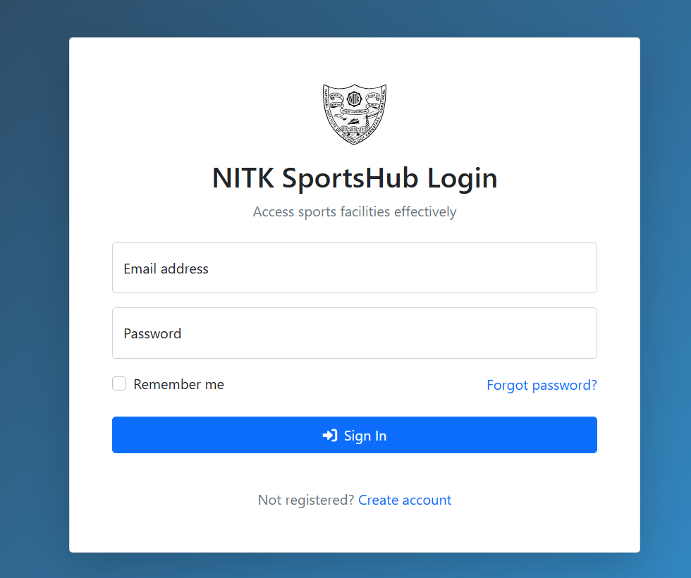  
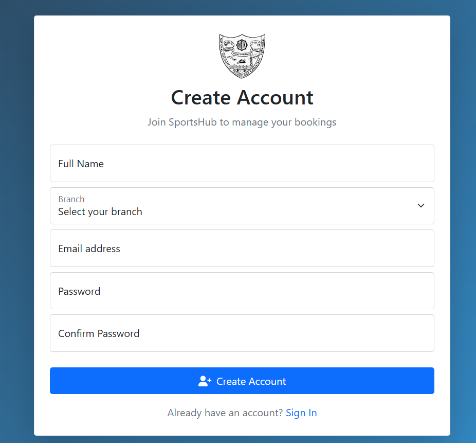  
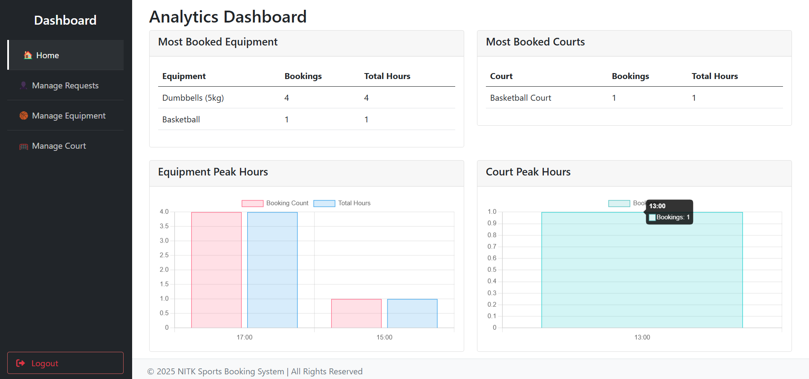  
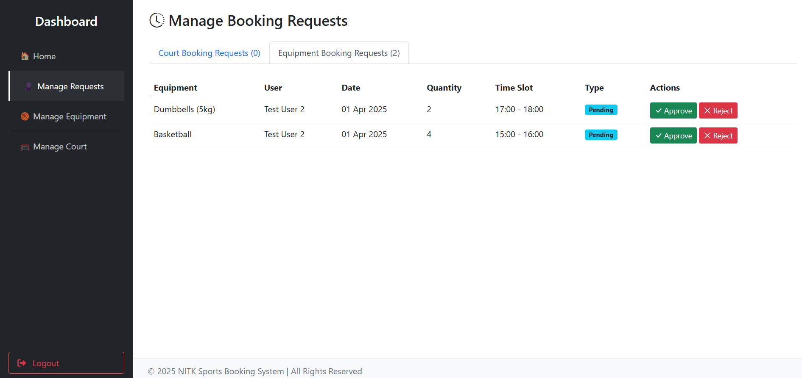  
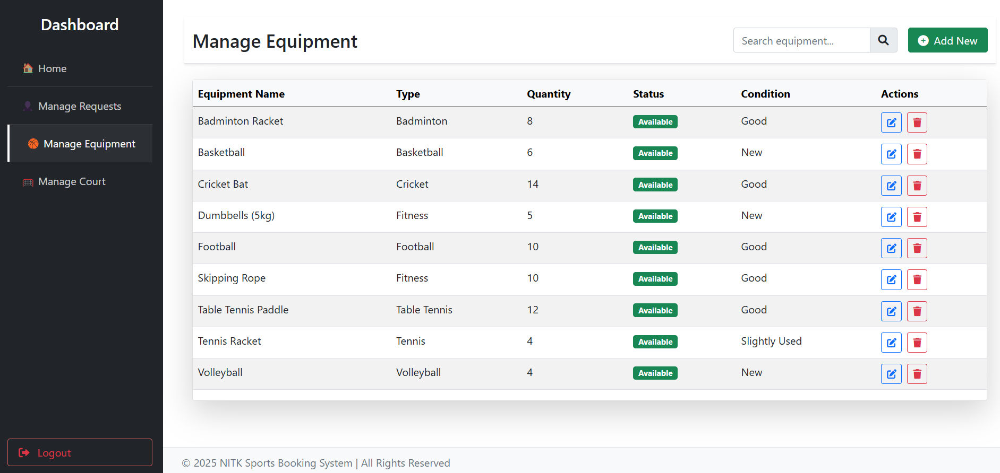  
  
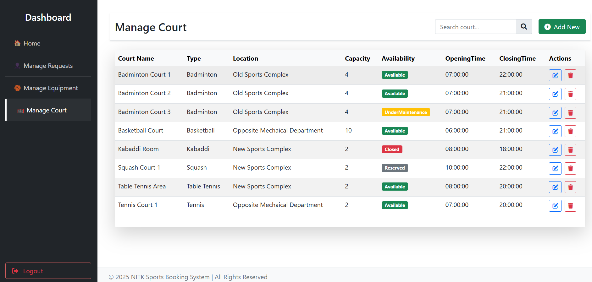  
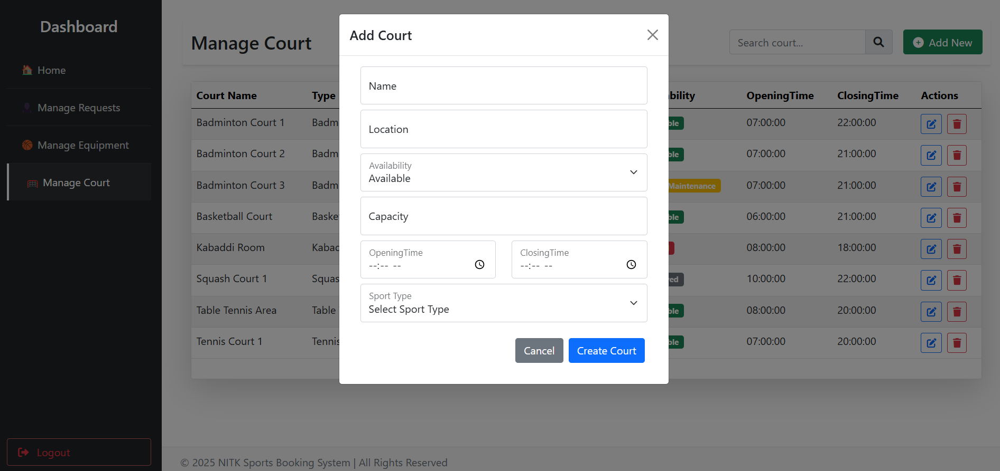
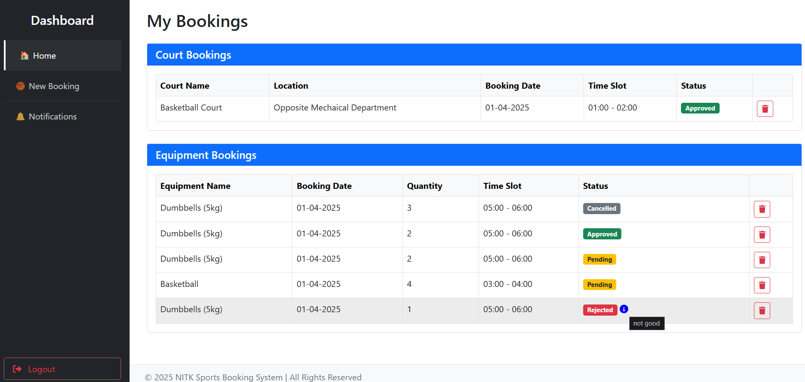  
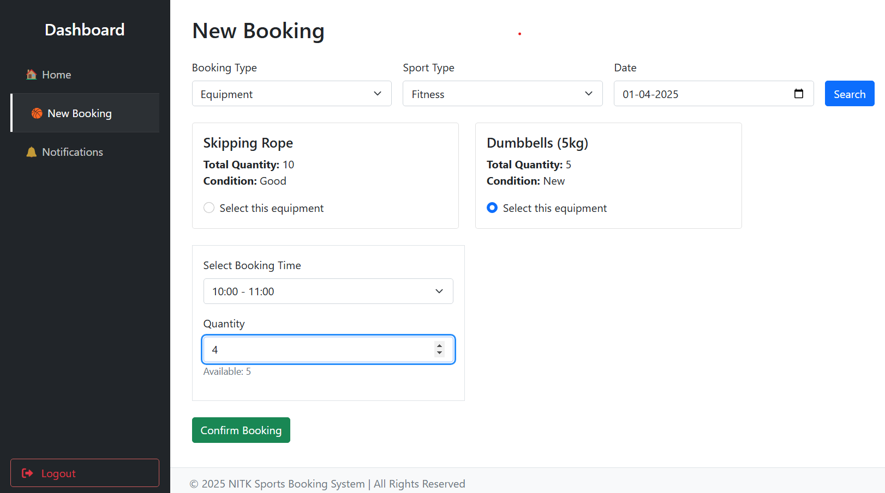  
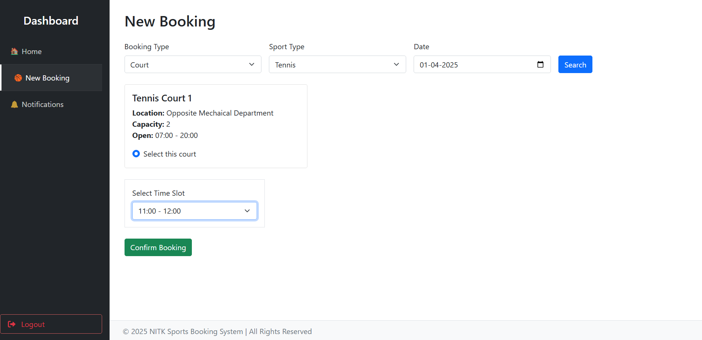  
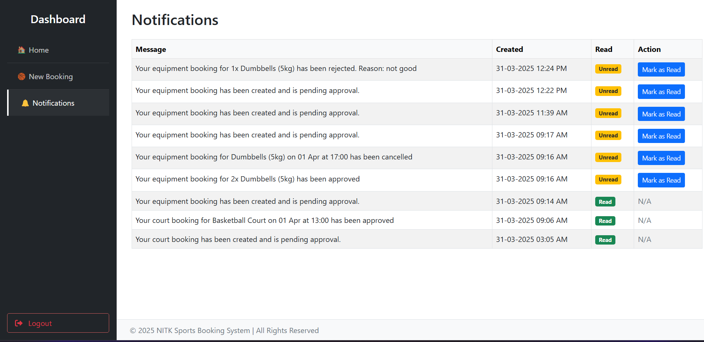  

---

## Tech used

1. ASP.NET 8 for backend MVC app.
2. Frontend mainly using html5, bootstrap, basic css and jquery.
3. Database used for development is **SQlite** can be easily changed to other databases like sql server or my sql. This choice is made for easy setup during development.
4. EF Core for database integration makes it very easy to use with .NET.
5. Sample data set up in migraitions and accessible during trial run after cloning.

---

## Installation Instructions

Follow these steps to set up the project from scratch:

1. **Clone the Repository:**

   ```bash
   git clone git@github.com:Shouryadip-C/IRIS_Web_Rec25_241EC152.git
   cd IRIS_Web_Rec25_241EC152
   ```

2. **Prerequisites:**

   - Download [.NET 8 SDK](https://dotnet.microsoft.com/en-us/download/dotnet/8.0) (8.0.14 used in this project) or later.

3. **Restore Dependencies:**

   ```bash
   dotnet restore
   ```

4. **Install the `dotnet-ef` Tool**: Run the following command to install it globally:  
	```sh
	dotnet tool install --global dotnet-ef
	```

5. **Apply Database Migrations:**

   Open a terminal or Package Manager Console in Visual Studio and run:

   ```bash
   dotnet ef database update
   ```

---

## Running the Project

Follow these steps to run the project:

1. **Build the Project:**

   ```bash
   dotnet build
   ```

2. **Run the Project:**

   ```bash
   dotnet run
   ```

3. **Access the Application:**

   Open your browser and navigate to `http://localhost:5010`

4. **Admin and test users Created Automatically** 

   - **Email** - `admin@nitk.edu.in` **Password** - `Admin@1234`
   - **Email** - `testuser1@nitk.edu.in` **Password** - `Test@1234`
   - **Email** - `testuser2@nitk.edu.in` **Password** - `Test@1234`

---

## Implemented Features

- **User Authentication:** Login, Register, and Role Management using ASP.NET Core Identity.
- **Admin Dashboard:**
  - CRUD operations for courts, equipment, and role management.
  - Basic search functionality
  - Approval/rejection of booking/cancellation requests
  - Analytics dashboard
- **Student Dashboard:** 
  - Book courts and equipment.
  - Dashboard for current bookings.
  - Dynamic time slot selection based on court availability.
  - Notifications for booking status updates.
- **UI:** Built with Bootstrap and jQuery.
- **Booking Management:** 
  - Prevent duplicate bookings by filtering out already booked slots.
  - Validation to ensure bookings are made only for the next day.

---

## Planned / Non-Implemented Features

- Advanced search and filtering options for available courts and equipment.
- User profile management (edit profile, view booking history).
- Enhanced notification system (email/SMS integration).
- Waitlist system for students to book facilities
- Email confirmation

---

## Known Bugs

- UI Not responsive on small screens

---

## References

- [ASP.NET Core Documentation](https://docs.microsoft.com/aspnet/core)
- [Entity Framework Core Documentation](https://docs.microsoft.com/ef/core)
- [Bootstrap Documentation](https://getbootstrap.com/docs)
- [jQuery Documentation](https://api.jquery.com/)
- [W3 Schools](https://www.w3schools.com/)
- [MDN](https://developer.mozilla.org/en-US/docs/Web)
- YouTube